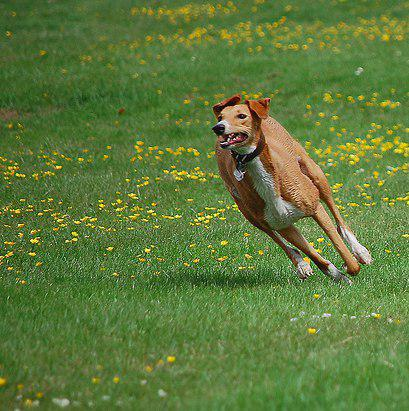
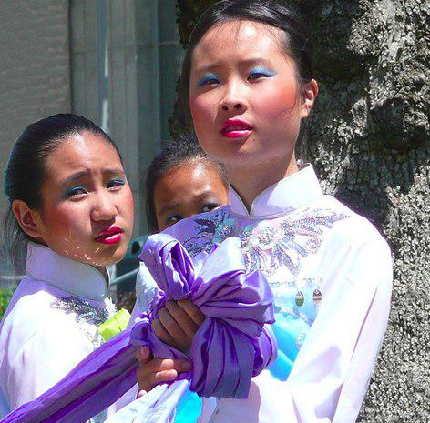
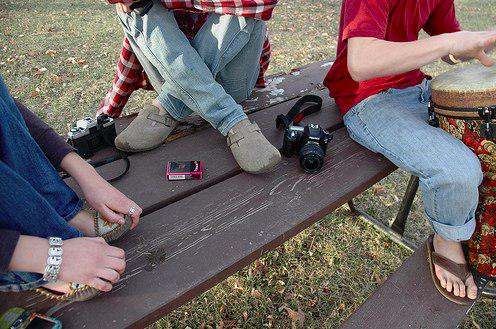

# Image Captioning

The goal of the project is to develop the neural network which will be capable of converting a given input image into a natural language description, that can describe what is going on that image.

## Content

- [Usage](#usage)
- [Architecture](#architecture)
- [Training](#training)
- [Testing](#testing)
- [Experiments](#experiments)
- [Metrics](#metrics)
- [Results](#results)
- [Dataset](#dataset)


## Usage

#### Clone the repository

#### Install requirements & download dataset and vocabulary

```bash
$ pip install -r requirements.txt
```
Download [Flickr8k](http://academictorrents.com/details/9dea07ba660a722ae1008c4c8afdd303b6f6e53b) and
vocabulary file [here](https://www.dropbox.com/s/26adb7y9m98uisa/vocap.zip?dl=0)

#### Train the model

```bash
$ python train.py    
```

#### Test the model 

```bash
$ python test.py --image='{name}.{ext}'
```

<br>

## Pretrained model
If you do not want to train the model from scratch, you can use a pretrained model. You can download the pretrained model [here](https://www.dropbox.com/s/vtbskghx7vg4q3f/weights.zip?dl=0) 


## Architecture
We use Encoder - Decoder architecture


Image Encoder -  [resnet-152](https://arxiv.org/abs/1512.03385) We load in a pretrained on ImageNet classification dataset model and remove the final layer
Text Decoder - LSTM (long short-term memory)

```python
class EncoderCNN(nn.Module):
    def __init__(self, embed_size):

        super(EncoderCNN, self).__init__()
        model = models.resnet152(pretrained=True)
        modules = list(model.children())[:-1]
        self.model = nn.Sequential(*modules)
        self.linear = nn.Linear(model.fc.in_features, embed_size)
        self.bn = nn.BatchNorm1d(embed_size, momentum=0.01)

    def forward(self, images):

        with torch.no_grad():
            features = self.model(images)
        features = features.reshape(features.size(0), -1)
        features = self.bn(self.linear(features))
        return features


class DecoderRNN(nn.Module):
    def __init__(self, embed_size, hidden_size, vocab_size, num_layers, max_seq_length=20):

        super(DecoderRNN, self).__init__()
        self.embed = nn.Embedding(vocab_size, embed_size)
        self.lstm = nn.LSTM(embed_size, hidden_size, num_layers, batch_first=True)
        self.linear = nn.Linear(hidden_size, vocab_size)
        self.max_seg_length = max_seq_length

    def forward(self, features, captions, lengths):

        embeddings = self.embed(captions)
        embeddings = torch.cat((features.unsqueeze(1), embeddings), 1)
        packed = pack_padded_sequence(embeddings, lengths, batch_first=True)
        hiddens, _ = self.lstm(packed)
        outputs = self.linear(hiddens[0])
        return outputs

```
## Training
We trained our model with cross-entropy loss (log loss).
Model's loss fall down up t 1,7 from 5,6 by 20th epoch. With 200th epoch weights (loss=0,03) model works preety accurate.

## Metrics

Generally, it's always a difficult task to choose the proper metric for NLP-related tasks. The reason is that we can not as easily compare words(and especially phrases, sentences, text corpuses) as we do with numbers(e.g. we can easily calculate some distance between them).

After the long exploration, we decided to try **BLEU** metric, because another were mostly pointed on other problems, which do not correlate with ours.

**BLEU**(Bilingual Evaluation Understudy) - a score for comparing a candidate translation of the text to one or more reference translations. For short, it is a metric for evaluating a generated sentence to a reference sentence. A perfect match results in a score of 1.0, whereas an ideal mismatch results in a score of 0.0.


Depend on the problem it could be pretty informative metric, but not in our case( Our model learned how to match objects on the image with words/phrases on the text and generalises the captions in such a way. It means that in 99% cases our model will **not predict** the *exact caption*, but **will predict**  * generalised caption* - with the same meaning and describing the same object, but differently. So, based on it, BLEU almost all the time will give us result very close to 0, which is not good and informative. 

All the experiments and code related to it you can find in `evaluate.py` file.

## Results

| ``` <start> two small girls laugh as a wave hits them at the beach . <end>``` | ```<start> the tan and white dog is running in the field . <end>``` | ```<start> two woman stand together and one holds a purple cloth . <end>``` | ```<start> two women play <unk> while a third man in the background . <end>``` |
| :----------------------------------------------------------: | :----------------------------------------------------------: | :----------------------------------------------------------: | :----------------------------------------------------------: |
|                                      |                                      |                                    |                                       |


​    


## Dataset
We used [Flickr8k](http://academictorrents.com/details/9dea07ba660a722ae1008c4c8afdd303b6f6e53b), which contains 8000 images with 5 description each 

<br>

# Thank u for your attention!


